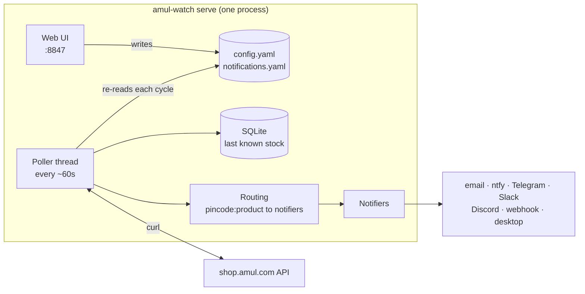

# Amul Stock Watch

Get a message the moment an Amul product is back in stock at *your* pincode.

Popular items on [shop.amul.com](https://shop.amul.com) (the high protein lassi and
buttermilk packs, for example) sell out within minutes of a restock, and stock differs
by delivery region. Amul Stock Watch checks the products you care about, for every
pincode you care about, about once a minute, and notifies the right people as soon as
something flips from out of stock to in stock.


## Features

- **Per pincode, per product, per person.** "Tell me and my sister when Rose Lassi is
  back in Bangalore; tell Dad only about Buttermilk in Delhi." Each of those is one
  *watch*.
- **Ten ways to be notified**: email (SMTP, Gmail app passwords work), phone push via
  [ntfy](https://ntfy.sh) (free, no account), Telegram, Discord, Slack (webhook or bot,
  channel or DM), any webhook as JSON, any local command, desktop notification, or just
  open the product page.
- **Web UI** to add watches, people and products, see live stock, send test alerts, read
  logs and the history of every alert sent. Or edit two commented YAML files; both stay
  in sync.
- **No login, no cookie copying.** It keeps its own anonymous shop session and restarts
  it when it expires. A human is only told when that fails.
- **Alerts once per restock.** Out-of-stock to in-stock sends one alert; staying in stock
  does not repeat it; selling out re-arms it. Optional quiet quantity updates.
- **Gentle on the shop.** Requests are spread evenly across the poll interval instead of
  fired in bursts, with jitter and backoff.
- **Runs anywhere.** macOS, Linux, Windows, or Docker. One process, no database server;
  state is a SQLite file.


## Quick start

You need Python 3.10+ and curl (built into macOS and Windows 10+).

**macOS / Linux**

```bash
curl -fsSL https://raw.githubusercontent.com/nmtjn1997/amul-stock-watch/main/scripts/install.sh | bash
```

```bash
amul-watch serve
```

**Windows (PowerShell)**

```powershell
irm https://raw.githubusercontent.com/nmtjn1997/amul-stock-watch/main/scripts/install.ps1 | iex
```

```powershell
amul-watch serve
```

**Docker**

```bash
git clone https://github.com/nmtjn1997/amul-stock-watch.git && cd amul-stock-watch
```

```bash
docker compose up -d
```

Then open <http://127.0.0.1:8847>. The first run creates an example watch (Rose Lassi at
pincode 110001, desktop notification). Replace it with your own in the UI.

**From source**

```bash
git clone https://github.com/nmtjn1997/amul-stock-watch.git && cd amul-stock-watch
```

```bash
pip install . && amul-watch init && amul-watch serve
```

To keep it running after you close the terminal:

```bash
amul-watch service install
```

That registers `amul-watch serve` with launchd (macOS), a systemd user unit (Linux) or
Task Scheduler (Windows). Docker needs nothing extra: the container restarts itself.

## Your first real watch

1. **Notifiers tab**: add a way to reach you. The fastest is `ntfy`: install the ntfy app
   on your phone, subscribe to a long random topic name, and enter the same topic here.
   Press **Test**; your phone should buzz.
2. **Watches tab** > **Add watch**: enter your pincode, tick the products, tick your
   notifier. Save.
3. Press **Test** on the watch to see exactly who would be alerted.

That is it. The poller picks up changes on its next cycle; there is nothing to restart.

More walkthroughs, including Telegram, Gmail and Slack setup and adding a product that
is not in the example list: **[docs/HOW-TO.md](docs/HOW-TO.md)**.

## How it works



A watch is a pincode, a product and a list of notifiers. Every cycle the poller asks the
shop for each watched product in each pincode's delivery zone, compares with the last
answer stored in SQLite, and on an out-of-stock to in-stock change sends one alert to the
notifiers routed for that pincode and product.

The full walkthrough, with sequence diagrams for the poll cycle, session handling and a
UI edit: **[docs/ARCHITECTURE.md](docs/ARCHITECTURE.md)**.

## Commands

| Command | What it does |
|---|---|
| `amul-watch serve` | Web UI and poller in one process |
| `amul-watch run` | Poller only, no UI (for servers) |
| `amul-watch status` | Is it polling, when did it last poll |
| `amul-watch stock` | Live stock table from the shop, no alerts |
| `amul-watch alerts` | Every active watch and who it alerts |
| `amul-watch simulate stock --pincode 560001 --dry-run` | Who would be alerted, send nothing |
| `amul-watch pause` / `resume` | Stop and start polling |
| `amul-watch doctor` | Check the whole setup end to end |
| `amul-watch service install` | Start in the background at every login |
| `amul-watch notifiers` | List notifier types and their settings |

`amul-watch --help` lists everything.

## Where things live

Everything is under one directory: `~/.config/amul-watch` on macOS and Linux,
`%APPDATA%\amul-watch` on Windows, `/data` in Docker. Override it with `--home` or
`AMUL_WATCH_HOME`. `amul-watch paths` prints it.

```
config.yaml          what to watch: pincodes, products, polling
notifications.yaml   who to tell: notifiers and routes
.env                 secrets (bot tokens, SMTP password), owner-only permissions
data/                SQLite state, logs, alert history, session cookie jar
```

Every key is documented in **[docs/CONFIGURATION.md](docs/CONFIGURATION.md)**.

## Security notes

- The web UI binds to `127.0.0.1` by default. If you expose it (Docker on a home server,
  `--host 0.0.0.0`), set `AMUL_WATCH_UI_PASSWORD` to require a password.
- Keep secrets in `.env` and reference them from YAML as `${NAME}`.
- An ntfy topic is effectively a password: anyone who knows it can read your alerts.
  Use a long random one.

## Documentation

- [HOW-TO.md](docs/HOW-TO.md): add a person, a product, a pincode; set up each notifier
- [ARCHITECTURE.md](docs/ARCHITECTURE.md): how it works inside, with diagrams
- [CONFIGURATION.md](docs/CONFIGURATION.md): every config key
- [EXTENDING.md](docs/EXTENDING.md): add a notifier type, run the tests
- [DESIGN-NOTES.md](docs/DESIGN-NOTES.md): decisions, trade-offs, known limits, roadmap

## Disclaimer

This is an unofficial personal project. It is not affiliated with or endorsed by Amul or
GCMMF. It reads the same public product data the shop's own web page loads, at a polite
rate. It never logs in, adds to cart or places orders. Please keep the poll interval
reasonable.

## License

MIT
