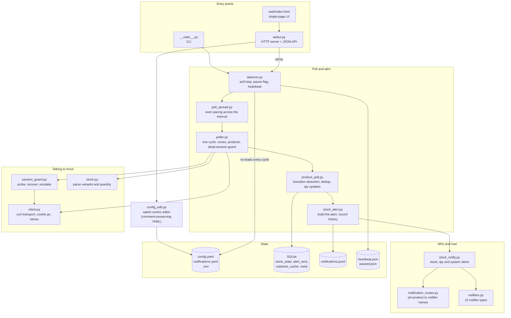
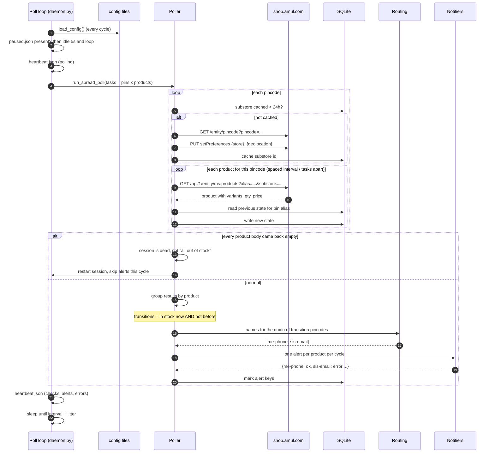
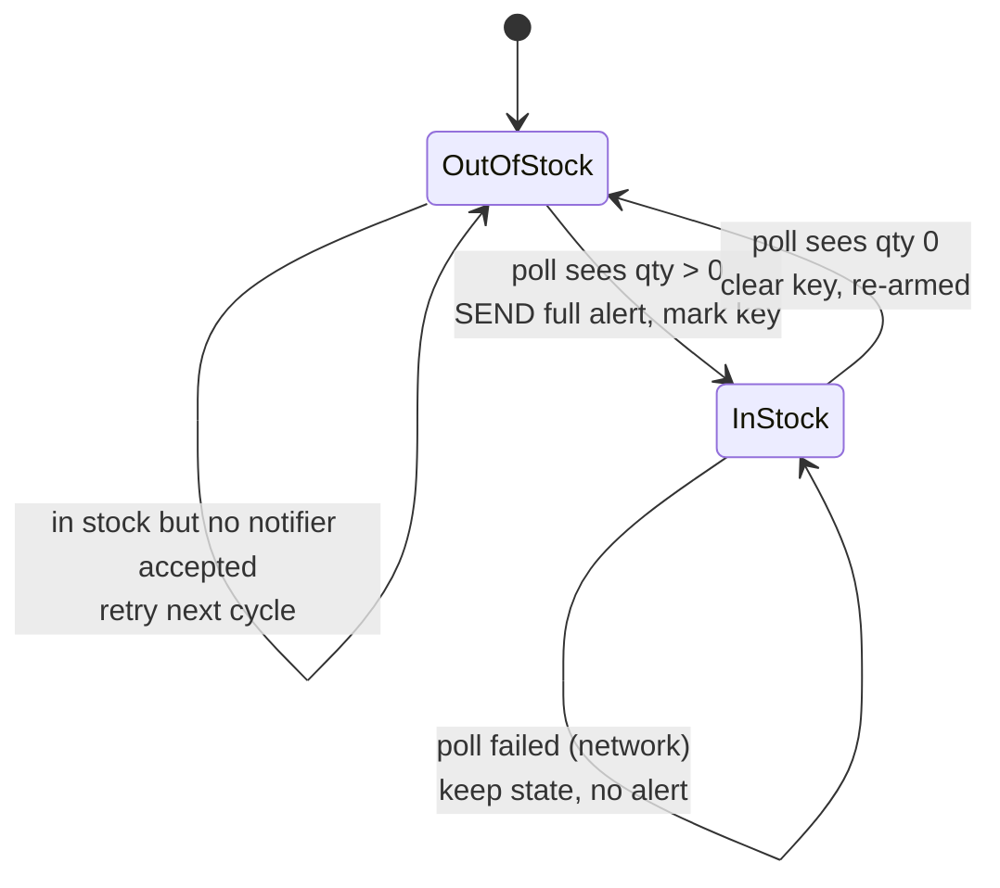
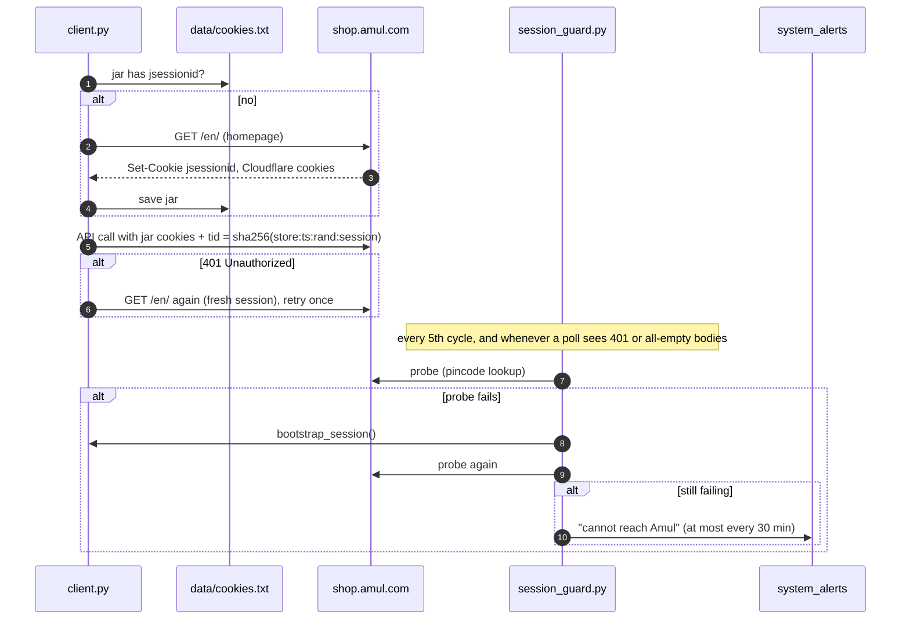
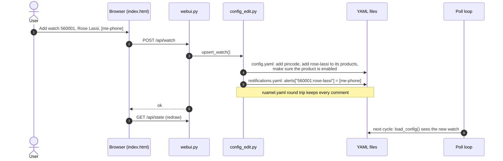
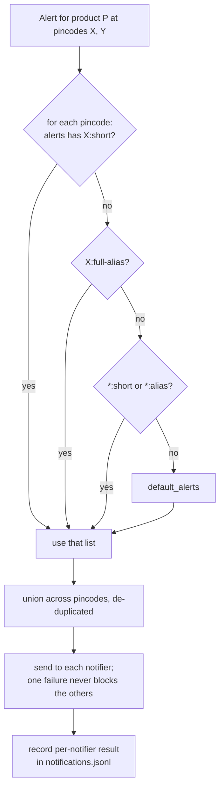

# Architecture

How Amul Stock Watch works, end to end. Read this before changing the poll loop, the
alert path or the session handling.

## The one idea

A **watch** is `pincode + product + notifiers`. Everything else exists to keep that
simple for the person editing it and correct for the person receiving the alert.

On disk a watch is spread across two files, and the editor keeps them consistent:

| Piece | Stored in | Example |
|---|---|---|
| The pincode | `config.yaml` `pincodes[]` | `560001`, enabled |
| The product at that pincode | `config.yaml` `pincodes[].products[]` | `rose-lassi` |
| The product itself | `config.yaml` `watchlist[]` | alias, short name, label |
| Who is told | `notifications.yaml` `alerts["560001:rose-lassi"]` | `[me-phone, sis-email]` |
| How to reach them | `notifications.yaml` `notifiers{}` | `me-phone: {type: ntfy, topic: ...}` |

## Components

### Module map

| Module | Responsibility |
|---|---|
| `config.py` | The home directory and every path under it; loading YAML with defaults; `init` from bundled examples |
| `client.py` | Every HTTP call to shop.amul.com via `curl`, the anonymous cookie jar, the `tid` request signature, retries and backoff |
| `session_guard.py` | Is the session usable; restart it; alert `system_alerts` only when recovery fails |
| `pincodes.py` | Enabled pincodes, public place names for messages, pincode to delivery-zone lookup (cached a day) |
| `watchlist_util.py` | Which products are polled at which pincode (the per-pin allowlist) |
| `poll_priority.py` | Optional weights so some products are checked more than once per cycle |
| `poller.py` | One cycle: build tasks, fetch, store, the dead-session guard, the CLI stock table |
| `poll_spread.py` | The same cycle with requests spread evenly across the interval |
| `product_poll.py` | Per product: which pins just came into stock, batch them into one alert, quantity updates |
| `stock_alert.py` | Compose the alert text, send it, mark the dedup key, write the history record |
| `notification_routes.py` | Route lookup and the human-readable descriptions |
| `notifiers.py` | The notifier types, `${VAR}` expansion, validation, isolated delivery |
| `stock_notify.py` | Glue from events (stock, qty, system) to notifier names |
| `daemon.py` | The long-running loop, pause flag, heartbeat, `status` |
| `webui.py` | Stdlib HTTP server, JSON API, optional basic auth |
| `config_edit.py` | The watch-centric write path the UI uses |
| `service.py` | launchd / systemd / Task Scheduler registration |
| `doctor.py` | End-to-end self check |

## Flow 1: one poll cycle

### Why each step is there

- **Config is re-read every cycle.** A UI edit (or a hand edit) takes effect within one
  interval, with no restart and no "apply" step. It also means no process can keep
  polling a stale set of pincodes after someone turns them off.
- **The session is switched to each pincode before its products are read.** The product
  API answers for the session's selected region and ignores its `substore` parameter, so
  the loop sets the region (two small PUTs) whenever it moves to the next pincode. The
  pincode to region lookup itself is cached for a day.
- **Requests are spread, not burst.** With 3 pincodes x 3 products the loop makes one
  request every ~5 seconds rather than 12 in a row. Friendlier to the shop, and a burst is
  what rate limiters look for.
- **Empty bodies mean a dead session.** A real out-of-stock product still returns its
  record with `available: 0`. If *every* product comes back empty, the session died, and
  treating that as "all out of stock" would reset every alert gate and cause a flood of
  false "back in stock" alerts on the next good cycle. So the cycle is discarded instead.
- **One alert per product per cycle.** If Rose Lassi comes back at three pincodes at
  once, each notifier gets one message listing all three, not three messages.

## Flow 2: the alert gate (dedup)

The gate is the `alert_sent` row per `pincode:alias`: a pincode is alerted when it is in
stock and has no row, and the row is written only after at least one notifier accepted
the alert. So a failed send (SMTP down, phone offline) or a restart between reading the
stock and sending is retried on the next cycle instead of being lost. Going out of stock
deletes the row, which re-arms the next restock.

Quantity updates (`qty_update_alerts`) compare against the last quantity actually
*reported*, not the previous poll, so a slow drain of 10, 9, 8, 7 still produces one
update once it adds up to `qty_update_min_delta`.

## Flow 3: the Amul session

The shop's API needs a session cookie (`jsessionid`) and a signed `tid` header; it does
not need a login. The client creates and maintains that itself.

An imported browser cookie (`amul-watch session import`, stored as `AMUL_COOKIE` in
`.env`) replaces the jar. It exists for networks where Cloudflare insists on a real
browser. When an imported cookie expires the guard cannot renew it, so it alerts with the
steps to refresh it.

### Why curl

All HTTP goes through the `curl` binary instead of Python's `urllib`. Cloudflare in front
of the shop fingerprints the TLS handshake, and curl's handshake looks like a normal
client. It also means one trust store: behind a corporate TLS proxy, setting
`CURL_CA_BUNDLE` fixes both the Amul calls and the notifier webhooks. curl ships with
macOS, Windows 10+, most Linux distributions and the Docker image.

## Flow 4: an edit in the UI

Disabling a watch *parks* it: the product moves from `products` to `disabled_products` on
that pincode, and its route stays. Re-enabling restores it without re-entering anything.

## Flow 5: routing

The first match wins; routes never merge across levels. That keeps "who gets this?"
answerable by reading one line of YAML, and `amul-watch alerts` prints the resolved
answer for every live watch.

## Process model

| Mode | Command | Use |
|---|---|---|
| Everything | `amul-watch serve` | Desktop use and Docker. UI in the main thread, poller in a background thread |
| Headless | `amul-watch run` | A server where you edit YAML by hand |
| UI only | `amul-watch ui` | Editing config while the poller runs elsewhere |
| One cycle | `amul-watch poll` | Cron, testing |

Liveness is `data/heartbeat.json`, rewritten at the start and end of every cycle. The UI
and `status` call the poller alive if the heartbeat is younger than three intervals. That
works identically on every OS and in a container, with no pid files and no signals.

Pause is `data/paused.json`. The loop checks it every cycle and idles while it exists. The
process and UI keep running, so resume is instant and can be done from the browser.

## Data

SQLite at `data/amul-watch.db`:

| Table | Key | Holds |
|---|---|---|
| `stock_state` | `pincode:alias` | in_stock, qty, variant, price, updated_at |
| `alert_sent` | `pincode:alias` | the restock alert for this pincode was delivered; cleared when it sells out |
| `substore_cache` | pincode | delivery-zone id and name, refreshed daily |
| `meta` | name | small values, such as the last reported unified quantity per product |

`data/notifications.jsonl` is append-only: one line per alert with the message, the
notifier names and each one's result. The UI's Notifications tab reads it.
`data/stock-inventory.csv` mirrors `stock_state` for spreadsheets.
