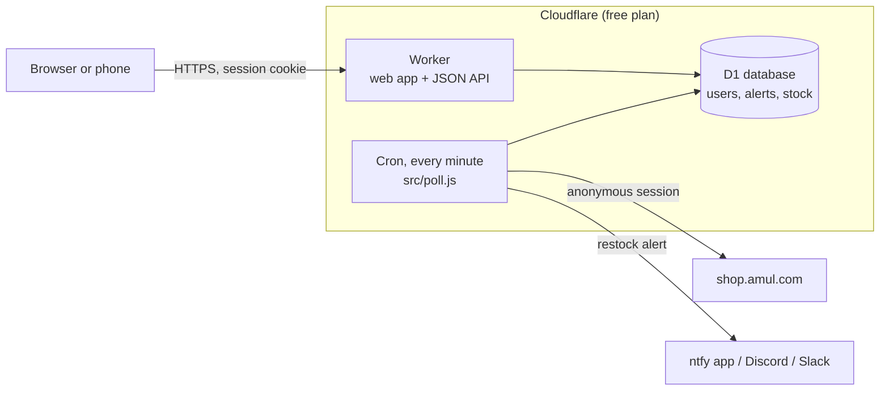

# Hosted edition (Back in Stock)

A multi-user version of Amul Stock Watch that runs on Cloudflare's free plan: people sign
up, add up to 10 alerts, and get a phone notification when a product comes back. No
server to keep running.

Live: <https://amul.backinstock.workers.dev>

The self-hosted app in `amul_watch/` is unchanged and still the right choice for one
household that wants every notifier type. This edition lives in `cloud/`.

## How it runs



- **Every minute** the cron takes each distinct pincode and product that anyone watches,
  reads it once, stores what changed, and sends one message per person per product.
  Ten people watching Rose Lassi in Bangalore cost one check, not ten.
- **The free plan allows 50 outbound requests per run**, so pincodes are visited in turn
  from a saved position. With a few dozen pincodes a full round takes a few minutes; the
  admin page shows how many pincodes the last run covered.
- **Alerts arrive as browser notifications** by default (Web Push). Chrome, Edge and
  Firefox on Android and computers work straight away; on iPhone and iPad (iOS 16.4+)
  the site is added to the Home Screen first. No app, no account, no quota: messages are
  encrypted for the device (RFC 8291) and signed with this site's key (VAPID).
- **ntfy and Discord/Slack are optional extras.** ntfy.sh without an account limits
  messages per sending IP, and every Cloudflare Worker shares the same IPs, so from
  Workers it often answers 429 (daily quota) or times out (522). If you want ntfy, add an
  ntfy.sh account token as the `NTFY_TOKEN` secret, or point `NTFY_SERVER` at your own.
  In practice ntfy.sh often times out from Workers even with a token.
- **Telegram (optional, reliable from Workers).** Create a bot with @BotFather and run
  `npx wrangler secret put TELEGRAM_BOT_TOKEN`. Each person presses Connect Telegram in
  Settings and then Start in the bot. The webhook registers itself on the first connect.
- **Everything is stored in D1**: accounts, alerts, the last stock seen per pincode and
  product, the 30-day message history and the shop session. Nothing is kept in the browser
  except the session cookie.

## Accounts and roles

| | Can do |
|---|---|
| Anyone | Create an account (while there are fewer than 100), log in |
| A user | See, add, pause and delete **their own** alerts (up to 10); set their notifications; change password; delete their account and all its data |
| Admin | Everything above, plus: see every account, disable or delete accounts, make or remove admins, add or hide products, see recent alerts and the poller's status |

Every query for a user's data filters on the signed-in user's id, on the server. The
Admin tab is hidden from other users, but the protection is the server's role check.

**Sign-in options:** username and password work out of the box. "Continue with Google"
appears once you add a Google OAuth client (below).

## Monitoring

Admin > **Monitor** shows, from D1:

- **Poller health**: healthy, running late (no run for 2.5 min), failing (the last 3 runs
  read nothing), or not running (no run for 5 min).
- **Last 24 hours**: requests sent to Amul, load per minute, product checks, alerts sent
  and not delivered, errors, active people, sign-ups, failed logins, run time, runs
  completed out of 1,440, pincode groups waiting.
- **Charts**: Amul requests, checks, alerts and failing runs per hour, and Amul requests
  per day for a week.
- **Recent runs**: every cron run with its numbers and any errors.

Admin > **Activity** is the event log: sign-ups, logins and failed logins, every alert
change, notification devices, test messages, alerts sent or not delivered, admin actions,
and server or poller errors. Filter by kind or search by user, product or pincode.
Instead of IP addresses it stores a short hash that changes every day, enough to see many
events coming from one place.

Runs are kept 7 days and events 30 days. Every log line also goes to Cloudflare Workers
Logs (`[observability]` in `wrangler.toml`), searchable in the Cloudflare dashboard for 3
days; the "Raw logs" button opens it.

## Limits and abuse protection

| Risk | Protection |
|---|---|
| Password guessing | A flood limiter (20 per minute per network, no database cost), then 30 attempts per 15 min per network, 8 per account per network, and 60 failures per account per hour from anywhere. Counters are atomic, so parallel guesses cannot slip past. Unknown usernames take as long to reject as real ones |
| Locking someone else out | Blocks apply to the guessing network, not the account, so the owner can still log in from their own |
| Stolen database | Passwords hashed with PBKDF2-SHA256 (100k rounds, per-user salt); only a SHA-256 of each session token is stored |
| Session theft | `__Host-` cookie, HttpOnly, Secure, SameSite=Lax, 30-day expiry; changing the password signs out other devices |
| Cross-site requests (CSRF) | Writes must be JSON and, when the browser sends an Origin, it must be this site |
| XSS | The UI inserts all data as text, never HTML; a strict Content-Security-Policy allows only this site's own scripts |
| Clickjacking | `frame-ancestors 'none'` and `X-Frame-Options: DENY` |
| Sign-up spam and seat filling | Cloudflare Turnstile human check on sign-up; at most 100 accounts; 3 new accounts per network per hour (IPv6 counted per /64, so address rotation does not help); 30 new accounts per hour overall, counted only on success |
| One person hogging resources | 10 alerts and 3 pincodes per person; every pincode must pass the (rate limited, 20 per hour) delivery check before an alert is saved; 60 writes per minute; password re-checks limited to 10 per 15 min |
| Stalling the poller | Work is split into units of at most 20 products, so no pincode is ever too big for one run |
| Using the service to spam | Webhooks only to `discord.com` and `hooks.slack.com` (no credentials, ports or redirects); push only to the browsers' own push services; ntfy topics are generated, not chosen; 5 test messages per hour; 5 devices per person |
| Impersonation in names | Control and bidi characters are stripped from display names |
| Losing the admin | The owner account (`OWNER_USERNAME`) can never be disabled, demoted or deleted, by anyone including itself; the last active admin cannot be removed either |
| Hammering Amul | One shop session shared by all users; each pincode and product is read once per round, spread over time |
| Personal data | Username or Google email only. Deleting an account removes its alerts and history immediately |

Known trade-offs:
- Someone controlling many networks can still push one account to the 60-failures-an-hour
  backstop. That needs dozens of networks and resets within the hour.
- Checking a username at sign-up tells you whether it is taken. That is normal for
  username accounts; no email addresses are exposed.
- A determined person solving the human check by hand could still create 3 accounts an
  hour per network. The admin can delete accounts, and `MAX_USERS` can go up.
- ntfy topics are private by obscurity (90 random bits). For stronger privacy, run your own
  ntfy server with access control and set `NTFY_SERVER`.

## Deploy your own

You need a free Cloudflare account and Node.js.

```bash
cd cloud
```

```bash
npx wrangler login
```

```bash
npx wrangler d1 create amul-watch
```

Put the printed `database_id` into `wrangler.toml`. Create a push key pair
(`node cloud/scripts/vapid-keys.mjs`), put the public key in `VAPID_PUBLIC_KEY`, and store
the private one:

```bash
npx wrangler secret put VAPID_PRIVATE_JWK < vapid-private.json
```

Then:

```bash
npx wrangler d1 migrations apply amul-watch --remote
```

```bash
npx wrangler deploy
```

The first deploy asks you to pick a `workers.dev` name if you have none. Then open the
printed URL, create your account, and make yourself admin:

```bash
npx wrangler d1 execute amul-watch --remote --command "UPDATE users SET role='admin' WHERE username='YOUR_USERNAME'"
```

### Turn on "Continue with Google" (optional)

1. In [Google Cloud console](https://console.cloud.google.com/apis/credentials), create an
   OAuth client of type **Web application**.
2. Authorised redirect URI: `https://<your worker URL>/auth/google/callback`.
3. Put the client ID in `wrangler.toml` as `GOOGLE_CLIENT_ID`, and your Google email in
   `ADMIN_EMAILS` if you want that account to be admin automatically.
4. Store the two secrets:

```bash
npx wrangler secret put GOOGLE_CLIENT_SECRET
```

```bash
npx wrangler secret put SESSION_SECRET
```

(`SESSION_SECRET` is any long random string; it signs the short-lived sign-in state.)

5. `npx wrangler deploy`.

### Settings

`wrangler.toml` `[vars]`: `MAX_USERS` (100), `MAX_WATCHES_PER_USER` (10),
`MAX_PINCODES_PER_USER` (3), `NTFY_SERVER` (`https://ntfy.sh`, or your own ntfy),
`ADMIN_EMAILS`, `GOOGLE_CLIENT_ID`, `TURNSTILE_SITE_KEY`.

Human check: create a Turnstile widget (Cloudflare dashboard > Turnstile) for your
worker's hostname, put its site key in `TURNSTILE_SITE_KEY`, and store the secret with
`npx wrangler secret put TURNSTILE_SECRET`. Without the secret the check is off.

Products people can pick are managed in the Admin tab: paste any product URL from
shop.amul.com.

## Develop locally

```bash
cd cloud && npx wrangler d1 migrations apply amul-watch --local && npx wrangler dev --test-scheduled
```

Trigger a poll with `curl "http://localhost:8787/__scheduled?cron=*+*+*+*+*"`. Behind a
corporate TLS proxy, start `wrangler dev` with `NODE_EXTRA_CA_CERTS=/path/to/ca.pem` so
the local runtime can reach the shop.

## Free plan budget (for 100 people)

| Resource | Free limit | Typical use |
|---|---|---|
| Worker requests | 100,000 / day | page views and API calls, plus the cron's 1,440 runs a day |
| Cron runs | every minute | 1,440 / day |
| Outbound requests per run | 50 | about 46 used when busy |
| CPU per request | 10 ms | a poll run measured 3 ms; password hashing at 100k rounds ran within the limit in testing |
| D1 reads | 5 million / day | well under 100,000 |
| D1 writes | 100,000 / day | stock is written only when it changes |
